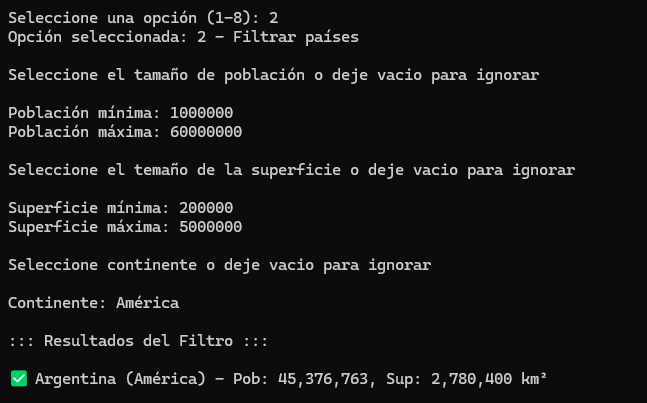
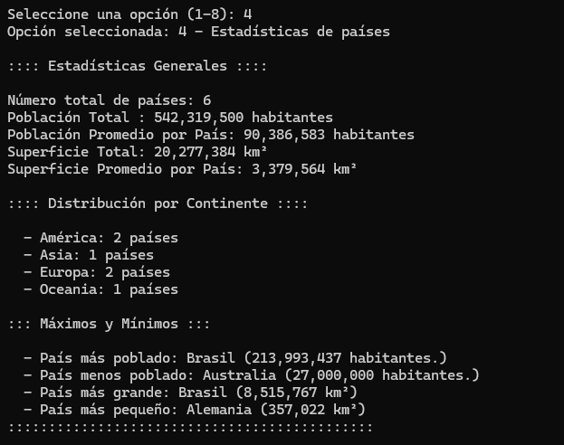

# 🌎 TPI Programación I — Gestión de Países

Este proyecto corresponde al **Trabajo Práctico Integrador de la materia Programación I**.  
Fue desarrollado en **Python 3** y permite gestionar información sobre distintos países utilizando un archivo CSV como base de datos.

---

## 🧠 Descripción del programa

El sistema permite:
- Leer datos de países desde un archivo `datos_paises.csv`.
- Buscar países por nombre (coincidencia parcial o exacta).
- Filtrar países por continente, rango de población o superficie.
- Ordenar países por nombre, población o superficie.
- Calcular estadísticas generales (totales, promedios, máximos y mínimos).
- Agregar, actualizar y eliminar registros de países.
- Guardar los cambios realizados en el archivo CSV.

El programa utiliza estructuras de datos como **listas y diccionarios**, junto con módulos estándar como `csv` y `os`.

---

## ⚙️ Instrucciones de uso

### 1. Requisitos
- Tener instalado **Python 3.10 o superior**.

### 2. Estructura de archivos
Asegúrate de tener en la misma carpeta:
gestion_paises.py
datos_paises.csv


### 3. Ejecución
Abrí una terminal en la carpeta del proyecto y ejecutá:
```bash
python gestion_paises.py
```

Aparecerá un menú principal con las siguientes opciones:
```bash
1) Buscar país por nombre
2) Filtrar países
3) Ordenar países
4) Estadísticas de países
5) Agregar nuevo país
6) Actualizar datos de país
7) Eliminar país
8) Salir
```

Seguí las instrucciones en pantalla para interactuar con el programa.

## 🧾 Ejemplo del archivo CSV

```csv
nombre,continente,poblacion,superficie
Argentina,America,45376763,2780400
España,Europa,47450795,505990
Japón,Asia,125800000,377975
Brasil,America,213993437,8515767
Australia,Oceania,25788217,7692024
```

## 💻 Ejemplos de uso

### 🔹 Ejemplo 1: Buscar país


### 🔹 Ejemplo 2: Filtrar países por continente



### 🔹 Ejemplo 3: Estadísticas




#### Materia: 
Programación I - Universidad Tecnológica Nacional
#### Integrantes:
 - Facundo Zerbato
 - Mauro Barua